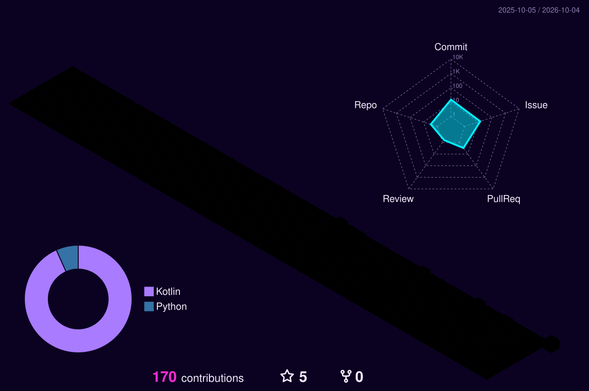

  

  
  
  
  
  
  

  

  
   
  

  
  
  
  
  

  
   
  A real DDA raycaster, the same algorithm as <a href="https://github.com/tukka25/cub3d">cub3d</a>, baked frame by frame into one SVG. No JS, no GIF. <a href="./scripts/raycaster.py">Source</a>.

  
  
  
  
  
  

  
  

  

  

  <picture>
    <source media="(prefers-color-scheme: dark)" srcset="https://raw.githubusercontent.com/tukka25/tukka25/output/github-snake-dark.svg">
    <source media="(prefers-color-scheme: light)" srcset="https://raw.githubusercontent.com/tukka25/tukka25/output/github-snake.svg">
    
  </picture>

  

